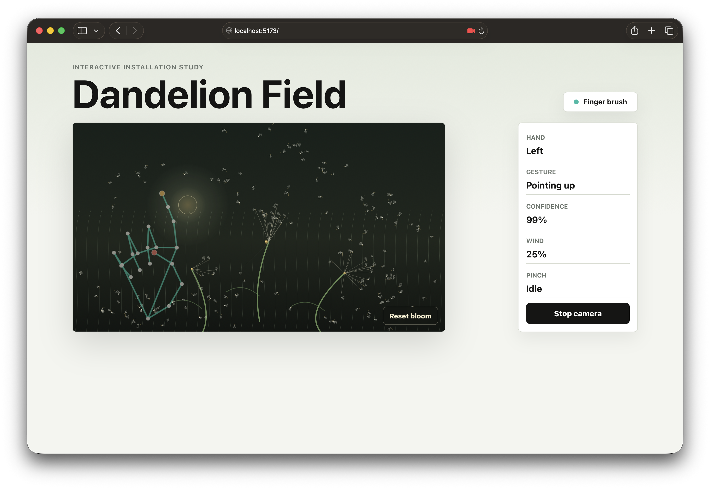
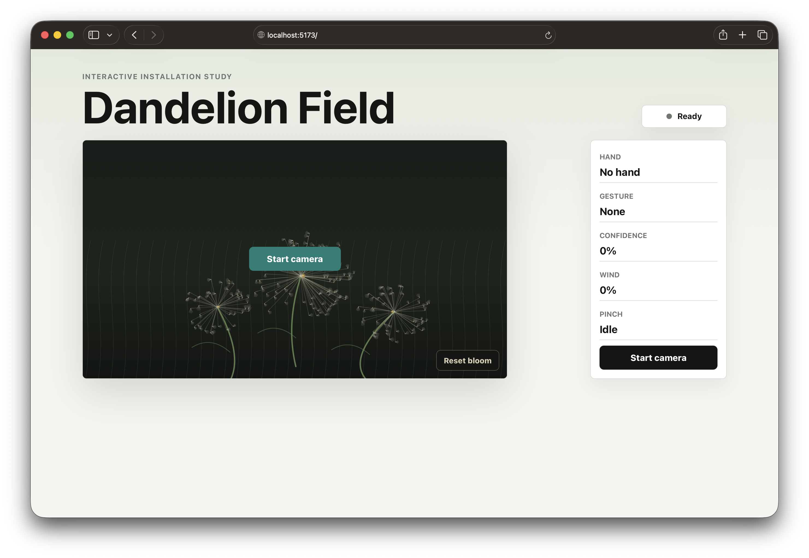
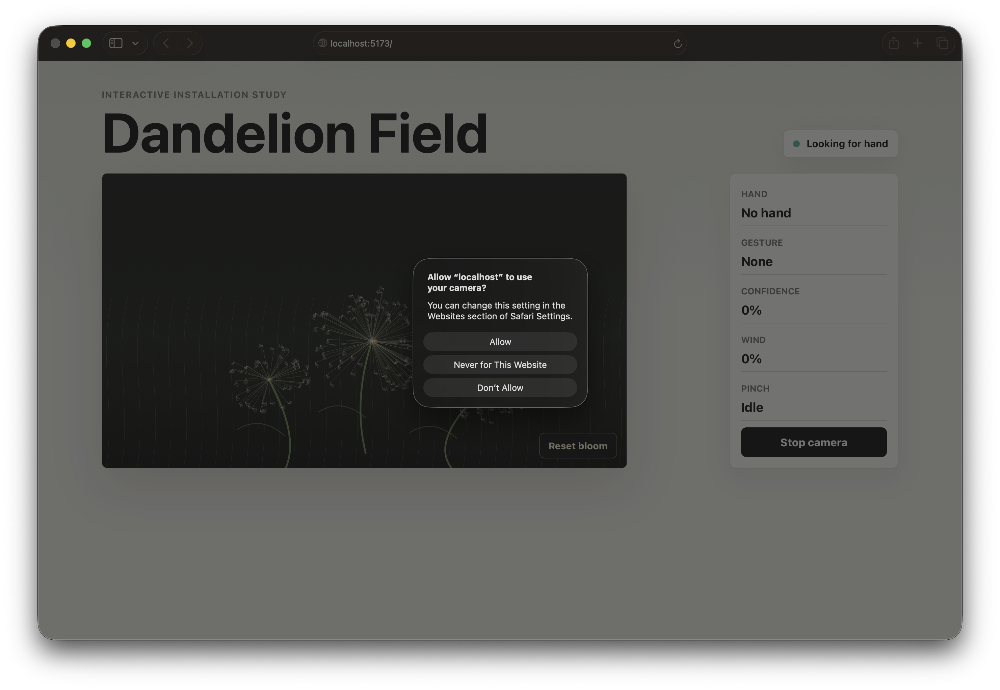
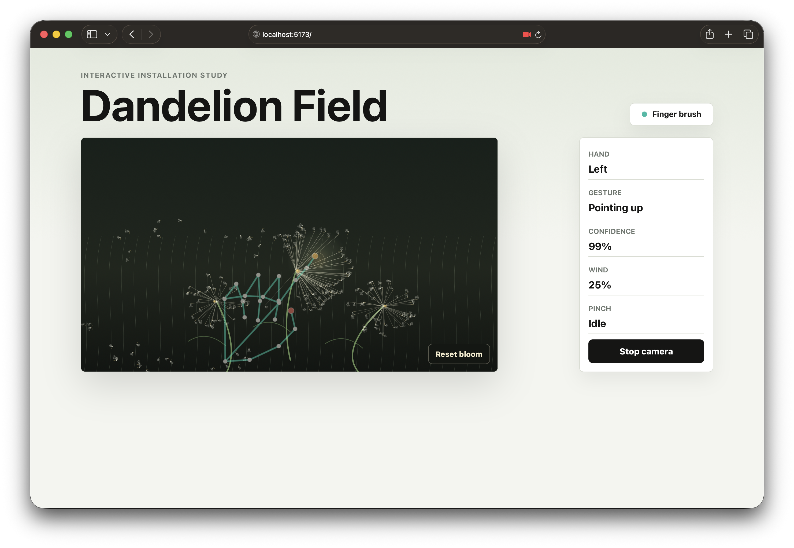

# Dandelion Field

Dandelion Field is a React and MediaPipe hand-tracking experiment inspired by
the YOKE/Sennep Dandelion installation:

[yoke.dk/projects/dandelion](https://www.yoke.dk/projects/dandelion)

Your fingertip and hand movement bend and release digital dandelion seeds.

The prototype is built for fast experimentation:

- move your index finger to brush the dandelions,
- open your hand to create a stronger wind field,
- pinch to pull loose seeds back toward your fingers,
- reset the bloom from the stage.



## Create Your Own Copy

Open the template:

[github.com/cederdorff/dandelion-experiment](https://github.com/cederdorff/dandelion-experiment)

Click `Use this template`.

Create a new repository in your own GitHub account.

## Clone and Run

Open your new repository on GitHub.

Click the green `Code` button.

Choose `Open with GitHub Desktop`.

In GitHub Desktop, choose a local folder and click `Clone`.

In GitHub Desktop, click `Open in Visual Studio Code`.

In VS Code, open a terminal and run:

```bash
npm install
npm run dev
```

Open the local URL shown in the terminal, usually:

```text
http://localhost:5173/
```

You should see the app in its ready state before starting the camera:



Then:

1. Click `Start camera` and allow webcam access.
2. Hold one hand in front of the camera.
3. Brush the dandelions with your index finger.
4. Open your hand to release seeds faster.
5. Pinch your thumb and index finger to pull drifting seeds.

If your browser asks for camera permission, allow access for `localhost`:



Webcam access works on `localhost` or `127.0.0.1`. Opening `index.html`
directly will usually block the camera.

## What to Try

Start with one hand clearly visible in the webcam. Move slowly at first, then
try different distances from the camera to see how the dandelion reacts.

Example interaction states:




The control panel shows the detected hand, gesture, tracking confidence, wind
strength, and pinch state.

## Project Structure

```text
src/
  App.jsx                         Puts the page together.
  components/
    DandelionField.jsx            Draws and animates the dandelion installation.
    TrackingStage.jsx             Layers the webcam, dandelions, and landmarks.
    ControlPanel.jsx              Shows hand, gesture, confidence, wind, and pinch.
    StatusPill.jsx                Shows the current tracking status.
  hooks/
    useHandTracking.js            Starts/stops tracking and reads webcam frames.
  gestures.js                     Converts landmarks into dandelion interaction.
  handTracking.js                 MediaPipe setup and hand drawing helpers.
  App.css                         App layout and component styling.
  index.css                       Global page styling.
  main.jsx                        Starts React.
```

## Main Editing Points

The project has three important layers:

1. The webcam sees your hand.
2. MediaPipe turns the hand into landmark points.
3. The dandelion animation reacts to those points.

You do not need to understand everything before changing the project. Start with
small changes in one file, then test in the browser.

### `src/components/DandelionField.jsx`

This is the main creative file. It draws the dandelions, animates the seeds, and
decides how seeds move after they are released.

Good places to tweak:

- `BLOOMS` controls how many dandelions there are, where they are placed, and
  how large they are.
- `createScene` creates all the seeds and gives each seed slightly different
  values.
- `resistance` controls how difficult it is to release a seed.
- `drawBackdrop` controls the background.
- `drawStems` controls the stems.
- `drawFluff` controls the look of each seed.
- `updateLooseSeed` controls how released seeds drift.

Try changing one number at a time. For example, make one bloom larger, reduce
the seed count, or make the seeds drift slower.

### `src/gestures.js`

`src/gestures.js` is where MediaPipe landmarks become interaction values. The
main flow is:

```js
const gesture = getHandGesture(landmarks);
updateDandelionWithGesture(gesture, interactionRef.current);
```

Good places to tweak:

- `interaction.force` controls how strongly your hand affects the seeds.
- `gesture.wind` is based on open fingers and pinch strength.
- `isPinching` decides when thumb and index finger count as a pinch.
- `isOpenHand` decides when the hand should act like wind.

If the dandelion reacts too strongly, lower the values used in
`interaction.force`. If it reacts too weakly, raise them.

### `src/hooks/useHandTracking.js`

This file connects the webcam to the dandelion. It loads MediaPipe, reads the
webcam frames, detects the hand, and sends the result to `gestures.js`.

You usually do not need to edit this file unless you want to change how tracking
starts, stops, or updates the control panel.

### `src/App.css`

This file controls the visual layout: page size, colors, panel styling, buttons,
and the stage around the dandelion canvas.

Good places to tweak:

- `.stage` controls the main dandelion area.
- `.control-panel` controls the debug panel on the right.
- `.reset-bloom` controls the reset button.
- `h1` controls the title size.

## Customization Ideas

This section is written as a mini workshop for students. Pick one idea, test it,
and commit before you try the next one.

Quick student workflow:

1. Make one small change.

- Change only one number or one condition at a time.
- Keep a quick note of the old value and new value.

2. Run `npm run dev` and test in the browser.

- Test with the same hand movement each time so results are comparable.

3. If the behavior is worse, undo that one change.

- Use undo immediately so you do not stack multiple confusing edits.

4. Write a short note about what you learned.

- Example: "Lower resistance from 0.48 to 0.30 made release too easy."

### Level 1 (easy wins)

- Make one large bloom instead of three by editing `BLOOMS` in
  `src/components/DandelionField.jsx`.
  - Help: start by deleting one bloom entry, then scale another bloom up.
  - Check: you should still see stable animation and at least one full flower.
- Adjust release difficulty by changing `resistance` values in
  `createScene` (`src/components/DandelionField.jsx`).
  - Help: lower values to make release easier, raise values to make it harder.
  - Check: brushing should feel noticeably easier or harder within 10 seconds.
- Change the atmosphere by tweaking colors in `drawBackdrop`
  (`src/components/DandelionField.jsx`).
  - Help: change one color stop first before changing all colors.
  - Check: background mood changes but flower and seeds remain visible.
- Update UI labels such as the reset button text in `src/App.css` and
  component markup.
  - Help: prefer short labels so buttons keep a clean layout.
  - Check: text is readable on desktop and mobile widths.

### Level 2 (interaction tuning)

- Make seeds float longer by adjusting speed decay and drift in
  `updateLooseSeed` (`src/components/DandelionField.jsx`).
  - Help: make small edits (about 10-20%) instead of large jumps.
  - Check: released seeds stay alive longer without looking frozen.
- Change how strong the hand feels by tuning `interaction.force` in
  `updateDandelionWithGesture` (`src/gestures.js`).
  - Help: keep a minimum force so the interaction never feels dead.
  - Check: closed hand is gentle, active gestures are clearly stronger.
- Make pinch less sensitive by changing the grip threshold near
  `const isPinching = grip > 0.6` in `src/gestures.js`.
  - Help: try values between `0.55` and `0.75` and compare.
  - Check: accidental pinches happen less often while intentional pinches still work.

### Fun challenge: only an open hand releases seeds

Goal: pointing and pinching can still track, but seed release should happen only
when the hand is open.

Suggested steps:

1. Open `src/gestures.js` and find `updateDandelionWithGesture`.

- Help: read from top to bottom once before editing so you understand all outputs.

2. Gate force so closed hands stay gentle. For example, compute a base force from
   movement, then add strong release force only when `gesture.isOpenHand` is
   `true`.

- Help: keep base force small so tracking still feels alive.

3. In `getHandGesture`, you can reduce wind from pinch by removing or lowering the
   `grip * 0.22` contribution in `wind`.

- Help: lower in small steps (for example `0.22 -> 0.15 -> 0.08`).

4. Test these cases:
   - Closed hand: tracks, but very little release.
   - Pointing up: mostly positioning, low release.
   - Open hand: strong release effect.

- Help: test each case for at least 5 seconds and compare confidence values.

If you want an even stricter version, in `src/components/DandelionField.jsx`
inside `applyBloomInfluence`, require `interaction.isOpenHand` in the release
condition before `releaseSeed(...)` is called.

### Level 3 (creative challenges)

- Regrow the dandelion over time after seeds are released.
  - Start idea: give each seed a cooldown timer, then reattach it.
- Make released seeds fade out with age.
  - Start idea: reduce alpha based on `(time - releaseAt)`.
- Bend stems toward or away from the hand position.
  - Start idea: map hand distance to a small stem angle offset.
- Replace the dandelion with another plant system (grass, leaves, petals).
  - Start idea: keep the same interaction model and only swap drawing functions.

### Debug tips for students

- If nothing happens, check camera permission first.
- Watch the control panel while testing so you can see gesture, confidence, and
  pinch/open-hand state.
- If behavior is noisy, lower sensitivity values before changing animation logic.
- If tracking lags, move closer to even lighting and reduce fast hand motion.
- If changes break the app, return to the last working edit and retry smaller steps.
